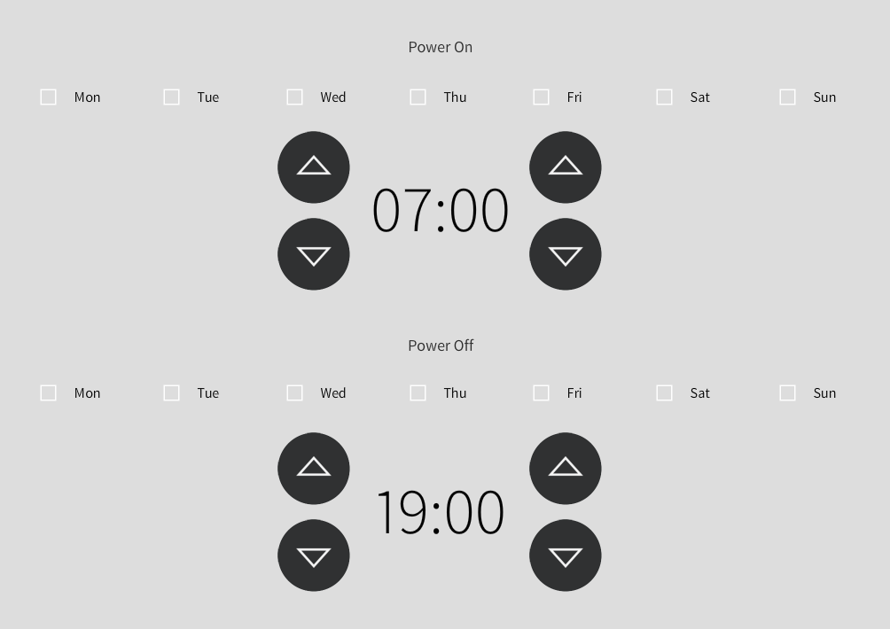

# crestron-schedule

SIMPL# Pro class to trigger automatic start/stop events

Includes sample UI. 



## Usage

```c#
     
Schedule schedule = new Schedule();

schedule.Init(tp);
schedule.AutoStart += new EventHandler(AutoStartTrigger);
schedule.AutoStop  += new EventHandler(AutoStopTrigger);

void AutoStartTrigger(object sender, EventArgs e)
{
    //start
}

void AutoStopTrigger(object sender, EventArgs e)
{
    //stop
}       

```

## Contributing
Pull requests are welcome. 


## License
[GPL-3.0](https://choosealicense.com/licenses/gpl-3.0/)